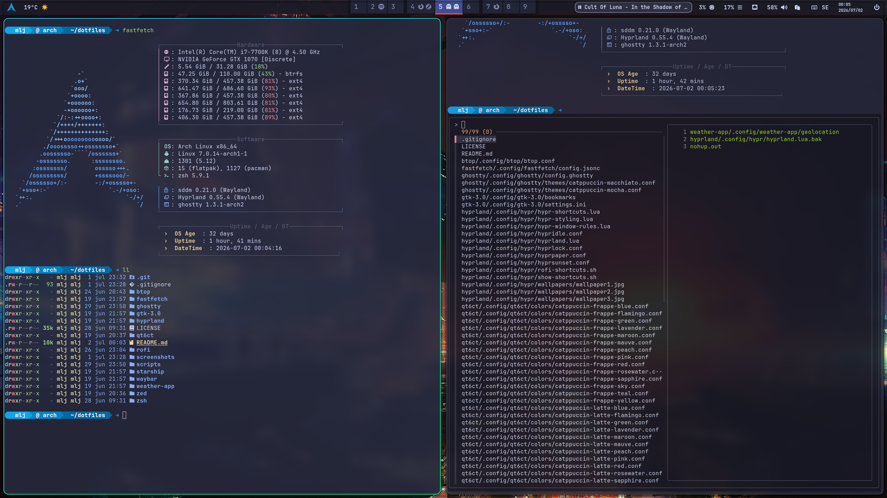

<div align="center">

# 🐚 muramasa-zsh-starship

Zsh & Starship configuration files


<br>


</div>

<p align="center">
  
</p>

## 📦 Contents

| Folder | Description |
|---|---|
| `zsh/.zshrc` | Zsh shell configuration |
| `starship/.config/starship.toml` | Starship prompt configuration |

## 🔧 Setup

### Requirements

- [Zsh](https://www.zsh.org/)
- [Starship](https://starship.rs/)
- [Nerd Font](https://www.nerdfonts.com/) (for icons)

### Installation with GNU Stow

```bash
git clone https://github.com/Muramasa500/muramasa-zsh-starship.git ~/muramasa-zsh-starship
cd ~/muramasa-zsh-starship
stow zsh starship
```

### Dependencies

Install required packages:

```bash
sudo pacman -S \
  zsh starship ttf-jetbrains-mono-nerd \
  zsh-autosuggestions zsh-history-substring-search \
  zsh-syntax-highlighting eza dust fd bat \
  ripgrep procs fzf zoxide sudo-rs fastfetch
  ```
